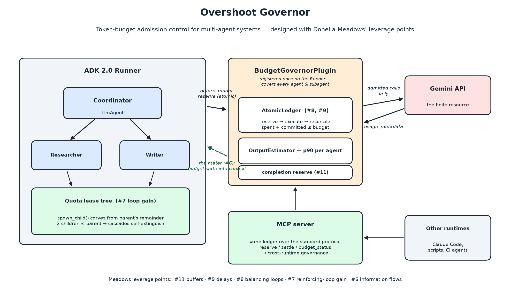

# Overshoot Governor

**Token-budget admission control for multi-agent systems, designed with Donella
Meadows.** Kaggle capstone (AI Agents: Intensive Vibe Coding, track **Agents
for Business**) — Roberto García Patrón.



A token budget in a multi-agent system has the three ingredients Meadows
identified for *overshoot and collapse*: growth (bursty concurrent calls), a
limit (the budget), and a delay in the feedback about the limit (in-flight
calls whose cost is unknown until they complete). This project builds the
governor that fixes it and evaluates it with three seeded experiments. Full
narrative: [`docs/kaggle_writeup.md`](docs/kaggle_writeup.md); executed,
reproducible report:
[`overshoot-governor-capstone.ipynb`](overshoot-governor-capstone.ipynb).

**Architecture: one policy core, two adapters.** The governor core
(`AtomicLedger`, `OutputEstimator`, `QuotaNode`) is a framework-agnostic
policy engine — pure Python, fully unit-testable, no I/O. Two thin adapters
expose the *same ledger*: the **ADK 2.0 Runner plugin** (the primary
enforcement point — registered once, it covers every agent and every spawned
subagent) and the **MCP server** (so non-ADK runtimes — Claude Code sessions,
CI scripts — share the same budget). Enforcement semantics live in one place
and cannot drift between surfaces; adding a third surface (e.g. a LiteLLM
proxy hook) would be another ~100-line adapter.

## Findings (seeded simulations, details in the notebook)

1. **Concurrent admission** — a naive check-then-act limit overshoots ~13%
   (races + invisible in-flight calls); atomic reserve/reconcile eliminates
   overshoot; a decentralized lease tree also never overshoots and needs no
   coordination, at the price of utilization. *Exactness costs coordination;
   autonomy costs utilization.*
2. **Subagent spawning** — per-agent caps don't compose: a spawn cascade
   reaches ~360 agents and ~260% overshoot. Lease inheritance (children carve
   quota out of the parent's remainder) turns the exponential cascade
   geometric: ~40 agents, 0% overshoot, self-extinguishing.
3. **The meter in the hallway** — identical enforcement, but agents that can
   *see* the remaining budget complete more tasks with fewer speculative
   calls. Meadows' Amsterdam electricity-meter effect, replicated on agents.
4. **The right of appeal** — a hard wall strands ~7 in-progress tasks (~17k
   tokens of sunk work wasted); letting a denied agent appeal with a
   mission-tied justification (granted from a protected tranche, rationed and
   logged, never touching the completion reserve) rescues nearly all of them
   — more tasks delivered while spending *less*, same hard cap, zero
   overshoot. Governed agents get voice, not just compliance.

## Layout

```
src/governor/          core: AtomicLedger, OutputEstimator, QuotaNode, AppealsDesk
src/governor/adk_plugin.py   BudgetGovernorPlugin (ADK 2.x Runner plugin)
src/governor/mcp_server.py   the same ledger as an MCP server (cross-runtime)
sim/simulation.py      the three experiments (python sim/simulation.py)
demo/run_adk_demo.py   live Gemini A/B demo: meter on vs off (needs GOOGLE_API_KEY)
tests/                 13 unit tests (races, atomicity, leases, appeals, MCP)
security/threat_model.md     STRIDE analysis (SKILLSTRIDE methodology)
docs/                  Kaggle writeup draft + video script
build_notebook.py      regenerates the Kaggle notebook from these sources
```

## Quickstart

```bash
pip install -r requirements.txt
python -m pytest tests -q      # 13 tests
python sim/simulation.py       # runs the 3 experiments, saves figures/
python demo/run_adk_demo.py    # live ADK demo (set GOOGLE_API_KEY first)
python -m governor.mcp_server  # governor as MCP server (GOVERNOR_BUDGET env)
```

For the MCP server, run it from `src/` (or `pip install -e .`); budget and
reserve come from `GOVERNOR_BUDGET` / `GOVERNOR_RESERVE` env vars. ADK agents
can mount its tools with `MCPToolset` (see the module docstring).

## Course concepts demonstrated (capstone rubric)

| Concept | Where |
|---|---|
| Multi-agent system (ADK 2.0) | [`src/governor/adk_plugin.py`](src/governor/adk_plugin.py), [`demo/run_adk_demo.py`](demo/run_adk_demo.py) |
| MCP server | [`src/governor/mcp_server.py`](src/governor/mcp_server.py) |
| Security features | [`security/threat_model.md`](security/threat_model.md), [Semgrep CI](.github/workflows/security.yml), [pre-commit](.pre-commit-config.yaml) |
| Agent skills | [SKILLSTRIDE](https://github.com/RobertoGPAI/SKILLSTRIDE) applied to this workspace |
| Deployability | MCP server runs standalone; ADK app servable via `adk api_server` (video) |

Submission assets: writeup draft in [`docs/kaggle_writeup.md`](docs/kaggle_writeup.md),
video script in [`docs/video_script.md`](docs/video_script.md), cover image
[`figures/architecture.png`](figures/architecture.png), executed notebook
[`overshoot-governor-capstone.ipynb`](overshoot-governor-capstone.ipynb).

## Security

Unbounded token spend is treated as a security problem (denial-of-wallet,
agent fork bombs, prompt-injection-driven budget drain), analyzed with the
[SKILLSTRIDE](https://github.com/RobertoGPAI/SKILLSTRIDE) STRIDE methodology —
see [security/threat_model.md](security/threat_model.md). Repo hygiene:
[pre-commit](.pre-commit-config.yaml) (ruff, private-key detection) and a
[Semgrep CI workflow](.github/workflows/security.yml) (`p/python`,
`p/security-audit`) on every push.

## References

Meadows, *Thinking in Systems* (2008) · Meadows, *Leverage Points* (1999) ·
Meadows et al., *The Limits to Growth* (1972) ·
[ADK Plugins](https://google.github.io/adk-docs/plugins/) ·
[ADK Agent Skills](https://developers.googleblog.com/developers-guide-to-building-adk-agents-with-skills/)
